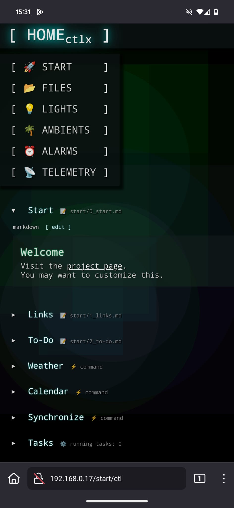
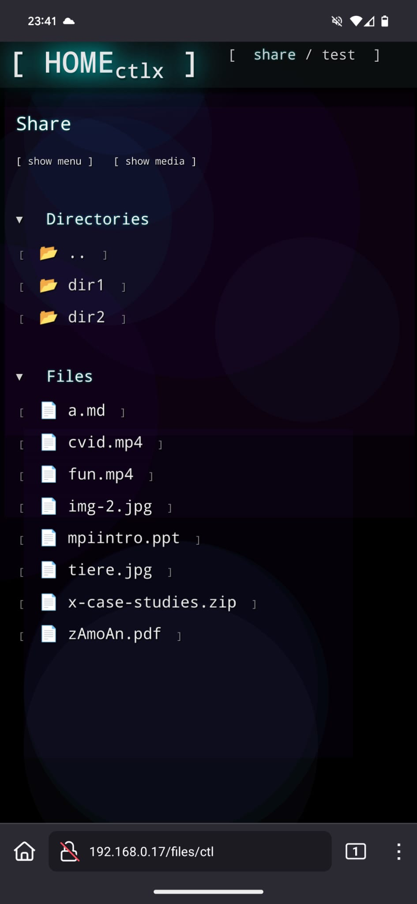
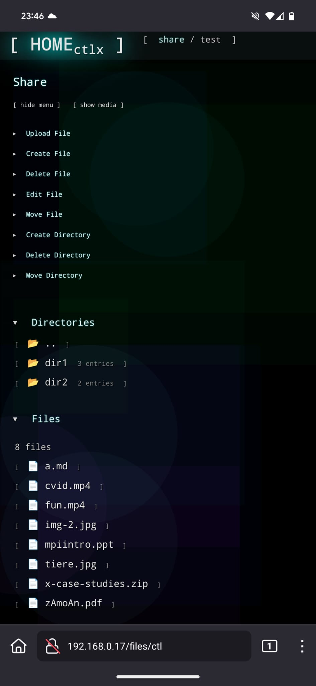
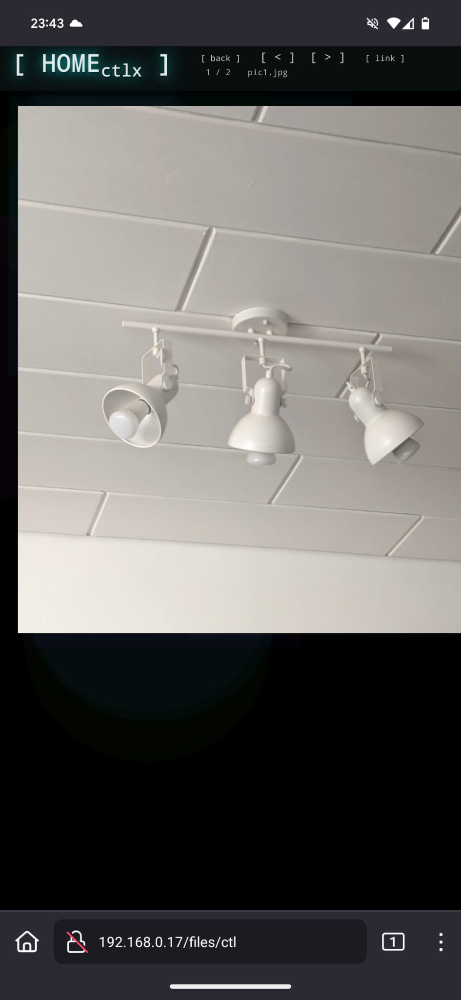
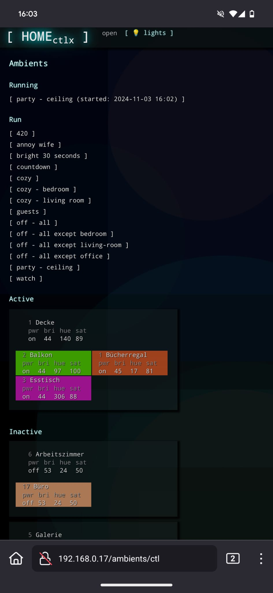

# HOMEctlx
HOMEctlx is a lean and modular smart home system.

## Modules and Functions
- **Files**: Share and edit files.
- **Light**: Control your Philips Hue light system.
- **Ambients**: Define static and dynamic scenes with a scripting language.
- **Alarms**: Schedule alarms and timers.
- **Telemetry**: Maintenance functions.

## Installation and Configuration
- `INSTALLATION` describes the requirements and setup process.
- Configuration is set in `config.json`.
- The `share` directory contains the files to be shared (and the landing page `start.md`). 

## Technical Background
Most user interface interactions in HOMEctlx are handled via a lean view-model framework. On the client side, JavaScript (cmdex.js) reacts to events, collects data from input fields, calls the server, and updates the user interface. On the server side, HTTP requests are managed by services/reqhandler.py. The received arguments are passed to the view-models, which process the actions and return metadata (types in services/meta.py) representing the new state of the user interface. The corresponding HTML is rendered and sent to the client, where the affected sections are updated. Files in share/start are displayed on the start page. Tasks (such as alarms, timers, and ambients) are stored in a SQLite database. The ambiscript interpreter uses the Jinja templating engine and provides access to Python's random module, along with various constants and utility functions. The generated ambiscript is passed to lightctl, a C++ program that interacts with the bridge to change the lights. In config.json, you can set the bridge address, specify the shared directory, and configure the commands that appear on the start page. Make sure to write-protect important files in your shared directory. Some built-in directories and files (e.g., ambiscript macros) cannot be deleted.

# Disclaimer and Author
This program is free software; you can redistribute it and/or modify it under the terms of the GNU General Public License (GPL) version 3 as published by the Free Software Foundation.
This program is distributed in the hope that it will be useful, but without any warranty; without even the implied warranty of merchantability or fitness for a particular purpose. 

Copyright (C) 2024 Christian Rauch.

# Impressions

